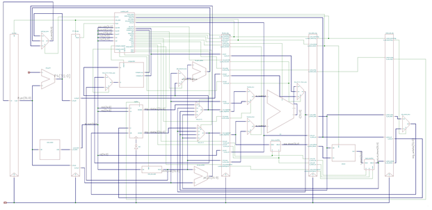

# COD_Lab

此仓库是武汉大学23级弘毅班计组实践课程代码仓库，包含单周期CPU实现，五级流水线CPU实现，基于五级流水线设计的简单应用（斐波那契数列的显示，1~4字符循环显示），基于五级流水线的复杂应用（连接VGA的走迷宫游戏）。

如果此仓库对你有所帮助，希望给作者一个小小的star⭐~

## 单周期CPU

此步骤涉及的修改应该只有dm_controller.v和top.v

## 五级流水线CPU

作者设计的流水线CPU可以解决数据冒险和控制冒险，支持前递和阻塞功能。

  
(此图片是之前在Github上找到的，但找不到出处了，放这里仅供参考)

文件夹下有两个测试，测试效果为AC循环显示以及贪吃蛇图形显示。

## 简单应用

此步骤是编写C语言代码，再通过交叉编译技术得到EDF文件，再放入IM中实现特定的功能。作者实现的是斐波那契数列的显示（16进制）以及1~4数字的循环显示。

注释：开关的地址为0xf0000000,数码管显示的地址为0xe0000000

## 复杂应用

此步骤需要修改总线以及连接VGA实现显示器图像显示，并设计一个小游戏。  
作者实现的是一个简单的走迷宫游戏，使用的是下面的拨码开关控制（测试时使用按钮读取很慢，且需要一直按住），连接了VGA，可以在屏幕上显示  
<del>没有设计终点，没有设计结束检测，最后一天赶制，比较粗糙</del>  
作者使用的总线参考自(https://github.com/Yinwei-Yu/Com_labs)
